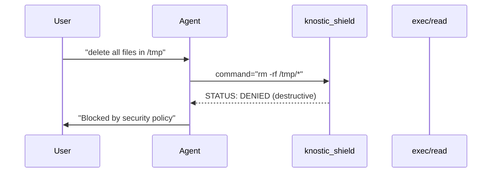

```
██╗  ██╗███╗   ██╗ ██████╗ ███████╗████████╗██╗ ██████╗
██║ ██╔╝████╗  ██║██╔═══██╗██╔════╝╚══██╔══╝██║██╔════╝
█████╔╝ ██╔██╗ ██║██║   ██║███████╗   ██║   ██║██║
██╔═██╗ ██║╚██╗██║██║   ██║╚════██║   ██║   ██║██║
██║  ██╗██║ ╚████║╚██████╔╝███████║   ██║   ██║╚██████╗
╚═╝  ╚═╝╚═╝  ╚═══╝ ╚═════╝ ╚══════╝   ╚═╝   ╚═╝ ╚═════╝
```

# OpenClaw Shield - Alpha

By [Knostic](https://knostic.ai/)

> openclaw-shield:** Security plugin for [OpenClaw](https://github.com/openclaw/openclaw). Prevents your AI agent from leaking secrets, exposing PII, or executing destructive commands.
**CRITICAL:** OpenClaw gets updated constantly, and without community updates, it won't stay effective for more than mere days. already we had to update it several times.

**By [Knostic](https://knostic.ai/)**

Also check out:
- **openclaw-detect:** https://github.com/knostic/openclaw-detect/
- **openclaw-telemetry:** https://github.com/knostic/openclaw-telemetry/
- **Like what we do?** Knostic helps you with visibility and control of your coding agents and MCP/extensions, from Cursor and Claude Code, to Copilot.

---

# OpenClaw Shield Plugin - TL;DR

Five layers of defense-in-depth security, each independently toggleable:

| Layer | What it does | Hook |
|-------|-------------|------|
| **L1 Prompt Guard** | Injects security policy into agent context so the LLM knows the rules | `before_agent_start` |
| **L2 Output Scanner** | Redacts secrets and PII from tool output before it hits the transcript | `tool_result_persist` |
| **L3 Tool Blocker** | Hard-blocks dangerous tool calls at the host level | `before_tool_call` |
| **L4 Input Audit** | Logs inbound messages and flags any secrets users accidentally send | `message_received` |
| **L5 Security Gate** | A gate tool the agent must call before exec or file-read, returning ALLOWED/DENIED | `registerTool` |

## Installation

```bash
openclaw plugins install @knostic/openclaw-shield
```

That's it. The plugin activates on the next gateway restart with all layers enabled in `enforce` mode.

## Configuration

Configure via OpenClaw's plugin config system. All settings are optional — defaults are secure out of the box.

```jsonc
// ~/.openclaw/config.json (plugin section)
{
  "plugins": {
    "openclaw-shield": {
      "mode": "enforce",       // "enforce" (block/redact) or "audit" (log only)
      "layers": {
        "promptGuard": true,   // L1
        "outputScanner": true, // L2
        "toolBlocker": true,   // L3 (requires host support)
        "inputAudit": true,    // L4
        "securityGate": true   // L5
      },
      "sensitiveFilePaths": [
        "\\.secret$",
        "internal/keys/"
      ],
      "destructiveCommands": [
        "docker\\s+system\\s+prune",
        "DROP\\s+TABLE"
      ]
    }
  }
}
```

### Options

| Option | Type | Default | Description |
|--------|------|---------|-------------|
| `mode` | `"enforce" \| "audit"` | `"enforce"` | In audit mode, findings are logged but nothing is blocked or redacted |
| `layers` | `object` | all `true` | Toggle individual layers on/off |
| `sensitiveFilePaths` | `string[]` | `[]` | Additional regex patterns for file-read gating (merged with built-in list) |
| `destructiveCommands` | `string[]` | `[]` | Additional regex patterns for command blocking (merged with built-in list) |

## How It Works

### L5: The Key Innovation

Traditional prompt-injection defenses (telling the LLM "don't do X") fail when the user directly instructs the agent to do something dangerous. The L5 security gate solves this by registering a **tool** called `knostic_shield` that the agent must call before every `exec` or `read` operation.



The gate tool returns `ALLOWED` or `DENIED`. If denied, the agent is instructed not to proceed. This works on **all** OpenClaw versions because it uses the tool registration API, not the `before_tool_call` hook.

### What Gets Detected

**Secrets**: AWS keys, Stripe keys, GitHub tokens, OpenAI/Anthropic keys, Slack tokens, SendGrid keys, npm tokens, private keys, JWTs, bearer tokens, generic API keys.

**PII**: Email addresses, US SSNs, credit card numbers, US/international phone numbers, IBANs.

**Destructive commands**: `rm`, `rmdir`, `unlink`, `del`, `format`, `mkfs`, `dd if=` (plus your custom patterns).

**Sensitive files**: `.env`, `credentials.json`, `.pem`, `.key`, SSH keys, `.netrc`, `.npmrc`, `.aws/credentials`, `.kube/config`, `/etc/shadow` (plus your custom patterns).

## Known Limitations

- **L3 (Tool Blocker)**: The `before_tool_call` hook is not wired in the published OpenClaw binary (v2026.1.30). L3 registers with feature detection and activates automatically when host support ships. L5 covers this gap.
- **L2 timing gap**: `tool_result_persist` fires at transcript-write time, not before the LLM processes the result. The LLM sees raw content for the current turn. L5's file-read gating with "don't output raw values" instruction mitigates this.
- **L5 is advisory**: The gate tool relies on the LLM following the security policy injected by L1. In testing, this is reliable but not cryptographically enforced. L3 will provide hard enforcement when the host wires it.

## Development

```bash
# Clone
git clone https://github.com/knostic/openclaw-shield
cd openclaw-shield

# Install locally for testing
openclaw plugins install ./
```

No build step required — OpenClaw transpiles TypeScript at load time via jiti.

## License

Apache 2.0 — see LICENSE for details.
