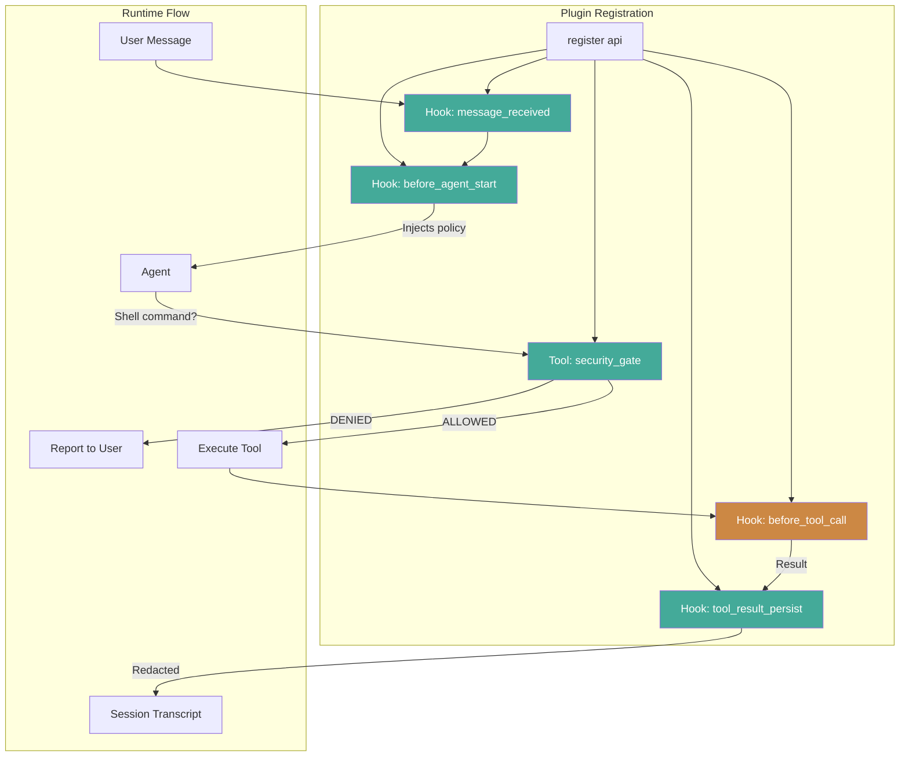

# Building Security Plugins for OpenClaw — Developer Guide

A practical guide for developers building new security or guardrail plugins for the OpenClaw agent framework. Based on real findings from building the Knostic Security Shield POC.

---

## Plugin Basics

### File Structure

```
~/.openclaw/extensions/your-plugin/
  index.ts              # Entry point (must export default with register())
  package.json          # Plugin metadata
  openclaw.plugin.json  # Plugin manifest with config schema
```

### Minimal Plugin

```typescript
import type { OpenClawPluginApi } from "openclaw/plugin-sdk";

export default {
  id: "my-plugin",
  name: "My Plugin",
  version: "1.0.0",
  description: "What it does",

  register(api: OpenClawPluginApi) {
    // Register hooks, tools, etc.
    api.logger.info("[my-plugin] loaded");
  },
};
```

### package.json

```json
{
  "name": "my-plugin",
  "version": "1.0.0",
  "type": "module",
  "openclaw": {
    "extensions": ["./index.ts"]
  },
  "peerDependencies": {
    "openclaw": "*"
  }
}
```

### openclaw.plugin.json

```json
{
  "id": "my-plugin",
  "name": "My Plugin",
  "description": "What it does",
  "configSchema": {
    "type": "object",
    "properties": {}
  }
}
```

---

## The Plugin API

When `register(api)` is called, `api` provides:

| Method | Purpose |
|---|---|
| `api.on(hookName, handler, opts)` | Register a typed hook |
| `api.registerTool(tool, opts)` | Register a custom tool |
| `api.registerHook(events, handler, opts)` | Register old-style hooks (fire-and-forget) |
| `api.logger` | Structured logging (`.info()`, `.warn()`, `.error()`, `.debug()`) |
| `api.config` | Access OpenClaw configuration |
| `api.registerHttpRoute(params)` | Register HTTP endpoints |
| `api.registerCommand(command)` | Register CLI commands |
| `api.registerService(service)` | Register background services |

---

## Hooks: What Actually Works

This is critical. OpenClaw defines 14 hooks, but **only 3 have invocation sites** in the published version (v2026.1.30). The rest are defined but never called from the execution path.

### Hooks That Fire (use these)

| Hook | Type | When | Can Modify? |
|---|---|---|---|
| `before_agent_start` | Modifying | Before agent processes a message | Yes — `prependContext`, `systemPrompt` |
| `tool_result_persist` | Modifying, **sync** | When tool result is written to transcript | Yes — `message` |
| `message_received` | Void | When inbound message arrives | No — observe only |

### Hooks That Do NOT Fire (registered but never called)

`before_tool_call`, `after_tool_call`, `message_sending`, `message_sent`, `agent_end`, `before_compaction`, `after_compaction`, `session_start`, `session_end`, `gateway_start`, `gateway_stop`

These hooks exist in the codebase and have runner functions, but no code calls them in the published binary. They may be wired in future versions.

**Recommendation:** Register hooks you need regardless of current support. Use feature detection (see below) so your plugin works on both current and future versions.

---

## Hook Patterns

### Pattern 1: Inject Context (before_agent_start)

Prepend policy text to the agent's context on every turn.

```typescript
api.on(
  "before_agent_start",
  async (_event, _ctx) => {
    return {
      prependContext: "<my-policy>Rules the agent must follow.</my-policy>",
    };
  },
  { priority: 100 },
);
```

**Key facts:**
- `prependContext` is prepended to the **user's message**, not the system prompt
- This makes it a soft guardrail — the model may override it for direct user instructions
- Fires on every agent turn (you'll see it fire multiple times per conversation)

### Pattern 2: Redact Tool Output (tool_result_persist)

Transform tool results before they're persisted to the conversation transcript.

```typescript
api.on(
  "tool_result_persist",
  // MUST NOT be async — this hook is synchronous
  (event, _ctx) => {
    const message = event.message;
    // Scan and redact...
    return { message: redactedMessage } as any;
  },
  { priority: 200 },
);
```

**Critical: This hook is synchronous.** If your handler returns a Promise (is `async`), the host will warn and **silently skip your result**. Do not use `async` or `await`.

**Timing gap:** The LLM sees the raw tool result before this hook fires. Redaction only affects the stored transcript (future turns). The LLM may output raw sensitive data in its current-turn response.

### Pattern 3: Feature Detection for Unwired Hooks

Register hooks that may not fire yet, with detection logic:

```typescript
let featureConfirmed = false;

api.on(
  "before_tool_call",
  async (event, _ctx) => {
    if (!featureConfirmed) {
      featureConfirmed = true;
      api.logger.info("[my-plugin] before_tool_call is supported on this host");
    }
    // ... your logic
  },
  { priority: 200 },
);
```

### Pattern 4: Audit Logging (message_received)

Observe inbound messages. This hook is void — you cannot modify or block.

```typescript
api.on(
  "message_received",
  async (event, ctx) => {
    console.log(`Message from ${ctx?.messageProvider}: ${event.content}`);
  },
  { priority: 50 },
);
```

---

## Registering Tools

The most powerful mechanism for security plugins. Tools become part of the agent's tool set — the agent can call them, and you control the response.

### Tool Shape

```typescript
api.registerTool(
  {
    name: "my_tool",
    label: "My Tool",
    description: "Description the LLM sees — be very explicit about when to use this tool",
    parameters: {
      type: "object",
      properties: {
        input: {
          type: "string",
          description: "What this parameter is for",
        },
      },
      required: ["input"],
    },
    async execute(toolCallId, params, signal, onUpdate) {
      const { input } = params as { input: string };

      // Your logic here...

      return {
        content: [{ type: "text", text: "Result text the LLM sees" }],
        details: { /* metadata for logging/UI */ },
      };
    },
  },
  { name: "my_tool" },
);
```

### The Security Gate Pattern

The most effective pattern we found for enforcement on the current version:

1. **Register a gate tool** that checks proposed actions
2. **Use `before_agent_start`** to inject instructions telling the agent to call the gate before acting
3. **The gate returns ALLOWED or DENIED** with clear instructions

```typescript
// In before_agent_start:
return {
  prependContext: "You MUST call my_security_gate before calling exec. If DENIED, do NOT proceed.",
};

// The gate tool:
api.registerTool({
  name: "my_security_gate",
  description: "You MUST call this before exec. Returns ALLOWED or DENIED.",
  parameters: {
    type: "object",
    properties: {
      command: { type: "string", description: "Command to check" },
    },
    required: ["command"],
  },
  async execute(_id, params) {
    const { command } = params as { command: string };

    if (isDangerous(command)) {
      return {
        content: [{
          type: "text",
          text: "STATUS: DENIED\n\nREASON: ...\n\nACTION: Do NOT execute.",
        }],
        details: { status: "denied" },
      };
    }

    return {
      content: [{
        type: "text",
        text: "STATUS: ALLOWED\n\nYou may proceed.",
      }],
      details: { status: "allowed" },
    };
  },
});
```

**Why this works better than prompt injection alone:** The agent makes a real tool call, receives a structured DENIED response, and acts on it. It's much harder for the model to ignore a concrete tool result than a prepended policy paragraph.

**Limitation:** The agent *could* theoretically skip the gate tool and call exec directly. The prompt injection makes this unlikely but not impossible. Once `before_tool_call` is wired in the host, that gap closes.

---

## Parameter Schema

Use plain JSON Schema objects for tool parameters. TypeBox (`@sinclair/typebox`) also works.

```typescript
// Plain JSON Schema (simplest)
parameters: {
  type: "object",
  properties: {
    query: { type: "string", description: "Search query" },
    limit: { type: "number", description: "Max results" },
  },
  required: ["query"],
}

// TypeBox (if you prefer typed schemas)
import { Type } from "@sinclair/typebox";
parameters: Type.Object({
  query: Type.String({ description: "Search query" }),
  limit: Type.Optional(Type.Number({ description: "Max results" })),
})
```

**Avoid in schemas:** `Type.Union`, `anyOf`, `oneOf`, `allOf` — some providers reject these. Use `Type.Optional()` instead of nullable types.

---

## Return Values from Tool Execute

```typescript
return {
  content: [
    { type: "text", text: "Text the LLM sees" },
    // or for images:
    { type: "image", data: base64String, mimeType: "image/png" },
  ],
  details: {
    // Arbitrary metadata — not shown to LLM, used for logging/UI
    status: "allowed",
    duration: 42,
  },
};
```

---

## Debugging Tips

1. **Use `console.log` liberally.** Plugin logs appear in the gateway log file at `/tmp/openclaw/openclaw-YYYY-MM-DD.log`. Prefix with your plugin name: `[my-plugin] ...`

2. **Use `api.logger`** for structured logs that appear with the `[gateway]` prefix:
   ```typescript
   api.logger.info("[my-plugin] Something happened");
   api.logger.warn("[my-plugin] Something concerning");
   ```

3. **Check the gateway log** after restarting to confirm your plugin loaded:
   ```bash
   tail -50 /tmp/openclaw/openclaw-$(date +%Y-%m-%d).log | grep my-plugin
   ```

4. **The gateway auto-discovers plugins** in `~/.openclaw/extensions/`. Just restart the gateway after changes.

5. **TypeScript is transpiled at load time** via jiti — no build step needed for plugins.

---

## Common Pitfalls

### 1. Async handler in tool_result_persist

```typescript
// WRONG — host silently skips the result
api.on("tool_result_persist", async (event, _ctx) => { ... });

// CORRECT — synchronous handler
api.on("tool_result_persist", (event, _ctx) => { ... });
```

### 2. Assuming hooks fire

Just because `api.on("before_tool_call", ...)` succeeds doesn't mean the hook will fire. Always check the [hooks that actually fire](#hooks-that-fire-use-these) table.

### 3. Relying solely on prompt injection

`prependContext` is prepended to the user's message, not the system prompt. For direct instructions ("delete this file"), the model may override your policy. Use the security gate pattern for enforcement.

### 4. Tool name conflicts

Don't register a tool with the same name as a built-in tool (`exec`, `read`, `write`, `edit`, etc.). The plugin system checks for conflicts and may reject your tool.

### 5. Forgetting the `label` field

`AgentTool` requires both `name` and `label`. The `name` is the machine identifier; `label` is human-readable.

---

## Reference Architecture: Security Plugin



Green = works on current version. Orange = requires host update.

---

## Full Working Example

See the Knostic Security Guard POC at `~/.openclaw/extensions/knostic-demo/index.ts` — a complete 5-layer security plugin (~600 lines) demonstrating all patterns described in this guide.

For the full technical analysis: `alex-docs/knostic-security-guard-analysis.md`
